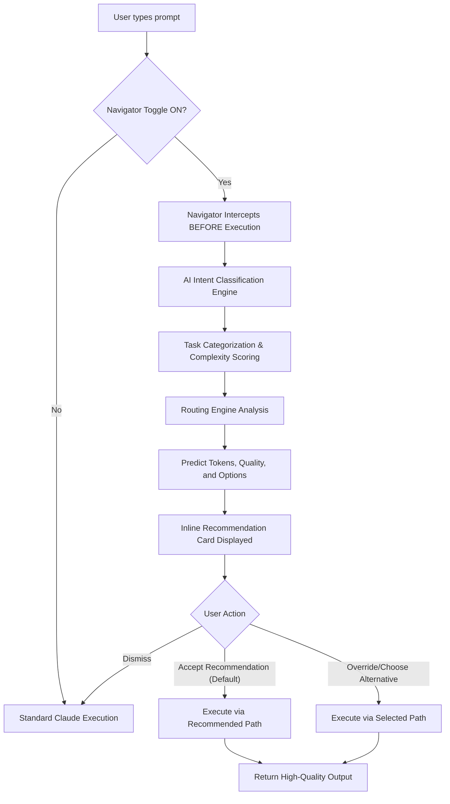

# 🧭 Claude Navigator: AI-Powered Intent Router (Prototype Spec)

> [!IMPORTANT]
> **Design Principle**
> This is a decision intelligence system embedded in UX, not just a cosmetic feature. The goal is zero-token waste and zero decision fatigue by intercepting user intent before execution and explicitly defining the optimal execution path.

---

## 1. User Flow Diagram

The following Mermaid diagram outlines the core interaction model for the Claude Navigator.

---

## 2. Key Screens & UI Components

### 2.1 The Entry Point: The Navigator Toggle
Seamlessly integrated into the existing Claude interface near the model selector.

**UI State:**
*   `[Model: Claude 3.5 Sonnet 🔽]`
*   `[✨ Claude Navigator: ON 🟢]` *(Subtle glowing indicator when active)*
*   `[Thinking Toggle: OFF]`

### 2.2 The Intent Insight Panel & Recommendation Card
Appears instantly below the prompt input box *after* the user hits Enter, but *before* the first token is generated.

**Microcopy & Layout:**

> **Claude Navigator has analyzed your intent.**
> 
> **Identified Task:** `Complex Content Creation + Structuring`
> 
> ✨ **Recommended Path: Structured Workflow**
> *Why?* Pitch decks require iterative refinement and precise formatting. This path guarantees higher structural quality and minimizes rework iterations.
> 
> | Option | Method | Estimated Tokens | Predicted Quality | Confidence |
> | :--- | :--- | :--- | :--- | :--- |
> | 🏆 **Option B** | **Structured Workflow** | ~650 - 800 | ⭐⭐⭐⭐⭐ (High) | 89% |
> | Option A | Direct Prompt | ~300 - 450 | ⭐⭐⭐ (Medium) | 72% |
> | Option C | Multi-step Agent | ~1200+ | ⭐⭐⭐⭐⭐ (Very High)| 83% |
> 
> `[ Execute Option B (Enter) ]`  `[ View All Options (Tab) ]` `[ Continue with Direct Prompt ]`

### 2.3 Interaction States
1.  **Typing State:** Navigator is silent.
2.  **Intercept State (< 400ms):** A skeleton loader with text *"Analyzing optimal execution path..."*
3.  **Recommendation State:** The Insight Panel is visible.
4.  **Execution State:** Panel minimizes into a persistent status badge showing the chosen route (e.g., *Running via: Structured Workflow*).

---

## 3. AI Decision Logic

### 3.1 Intent Classification System
Categorizes the prompt into established taxonomy:
*   **Categories:** `Content Creation`, `Data Analysis`, `Code Generation`, `Research`, `Creative Brainstorming`, `Refactoring`.
*   **Complexity Scorer:** `0.0` (Trivial) to `1.0` (Extremely complex/multi-step).
*   **Ambiguity Detector:** Checks if the prompt lacks necessary constraints (e.g., "help me with startup" triggers high ambiguity).

### 3.2 Routing Engine Rules
| User Intent Profile | Recommended Route | Decision Rule |
| :--- | :--- | :--- |
| Simple Q&A, low complexity (<0.3) | **Direct Prompt** | If task requires < 1 turn and standard knowledge retrieval. |
| Structured outputs, templates (0.3 - 0.7) | **Structured Workflow** | If task benefits from sequential generation or specific formatting (e.g., Pitch Deck, PRD). |
| Complex code refactoring, research (>0.7) | **Agent (Multi-step)** | If task requires tool use, self-correction, or deep contextual understanding. |

### 3.3 Token Estimation & Quality Prediction Models
*   **Token Predictor:** Uses lightweight heuristics based on prompt length, task category, and chosen method to output a confidence interval (e.g., 500-800 tokens).
*   **Quality Scorer:** Predicts output quality (Low/Medium/High) by comparing the prompt's constraints against the minimum requirements for the selected routing method.

---

## 4. Example Scenarios

### Scenario 1: The Suboptimal Prompt
**User Prompt:** *"Write a python script to scrape data from a website."*
**Navigator Action:** Intercepts.
*   **Analysis:** High ambiguity, missing target URL, missing data format.
*   **Recommendation:** `Agent (Multi-step)`.
*   **Microcopy:** *"Recommendation: Multi-step Agent. This task requires browsing capabilities and iterative testing to handle website structures properly."*

### Scenario 2: The Complex Content Request (Token Heavy)
**User Prompt:** *"Create a 10-slide investor pitch for a SaaS startup."*
**Navigator Action:** Intercepts.
*   **Analysis:** Medium-high complexity, requires structuring.
*   **Recommendation:** `Structured Workflow`.
*   **Microcopy:** *"Recommendation: Structured Workflow. Breaking this into slide-by-slide generation ensures higher quality formatting and saves tokens on massive single-shot revisions."*

### Scenario 3: The Trivial Question (Low Friction)
**User Prompt:** *"What is the capital of France?"*
**Navigator Action:** Silent / Auto-Execute.
*   **Analysis:** Trivial complexity. Confidence 99%.
*   **Action:** Bypasses UI interruption, executes Direct Prompt immediately to avoid friction.

---

## 5. Edge Cases & Uncertainty Handling

| Edge Case | Navigator Response | Microcopy / Action |
| :--- | :--- | :--- |
| **Highly Ambiguous Prompt** | Trigger Uncertainty State | *"Your prompt is very open-ended. To save you tokens, what specific outcome are you looking for?" [Input Box]* |
| **Confidence < 60%** | Fallback to Direct Prompt | *"Confidence low. Proceeding with standard execution. For better routing next time, add more constraints."* |
| **User in a hurry (Ignores UI)** | Auto-accept default | If no action within 5 seconds, auto-execute the recommended path. |
| **Power User Override** | Learn & Adapt | User selects "Direct Prompt" despite Agent recommendation. Navigator logs preference for future weighting. |

---

## 6. Trade-offs & Limitations

*   **Latency Cost:** The intercept phase adds ~200-400ms of latency before generation begins. We mitigate this with skeleton loaders and fast, lightweight classification models.
*   **False Positives:** Recommending a high-token Agent for a task the user considers simple might reduce trust. We mitigate this through conservative confidence thresholds.
*   **UI Clutter:** Introducing an intermediary screen risks annoying users. We mitigate this by making it keyboard-navigable (`Enter` to accept) and completely interruptible.

---

## 7. Success Metrics

1.  📉 **Token Efficiency:** Decrease in the average number of abandoned prompts/regenerations per session.
2.  📈 **First-Attempt Success Rate:** Increase in user acceptance of the *first* generated output (measured by lack of immediate follow-up corrections).
3.  🚀 **Feature Adoption:** 30%+ increase in the utilization of Workflows, Agents, and Tools compared to standard prompt usage.
4.  🔄 **Override Rate:** The percentage of times users reject the Navigator's recommendation (Target: < 15%).
5.  ⭐ **User Trust:** Qualitative survey score on "Did Claude understand your intent before generating?".
